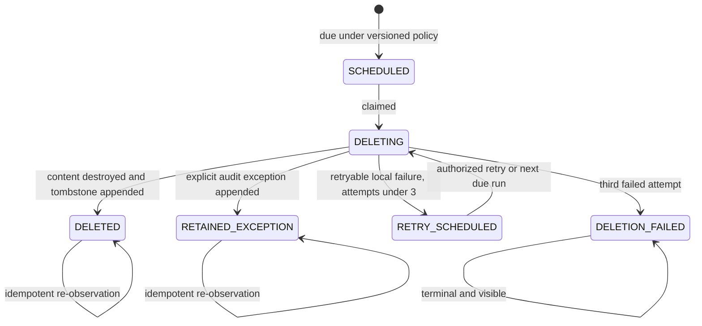

# Slice 5A local operations

Slice 5A is a local-only operational control plane for synthetic demo data. It does not activate production authentication, real data, cloud storage, external notifications, Broadvoice, or a provider request. The visible Operations page is available to the allowlisted demo administrator and operations identities. The reviewer receives a sanitized denial.

## Architecture and data flow

1. A strict `local-firm-configuration-v1` payload is validated by Pydantic and database checks.
2. Only the server-resolved `demo-admin` principal may publish it. Publication inserts a new immutable row and a content-free audit event; it never updates an earlier version.
3. Retention evaluation reads the current version and compares persisted timestamps to an injected clock. Not-due rows are untouched. Due rows receive one immutable-target deletion job.
4. The executor recovers interrupted `DELETING` work, claims scheduled work, removes or scrubs content through the local-only retention context, inserts an append-only tombstone, and records an audit transition.
5. The Operations page reads safe counts only. It never returns transcript excerpts, notes, filenames, storage paths, phone numbers, request bodies, credentials, or provider output.
6. The backup/restore drill uses disposable SQLite databases containing invented identifiers only, reapplies retention after an isolated restore, verifies the ordinary database signature is unchanged, and deletes every disposable artifact.
7. Notification preview persists a safe count and internal reference with `external_attempts = 0`. Any non-`noop` adapter fails closed.

The active OpenAI CLI boundary remains unchanged. An unsupported host CLI still selects the accepted `fixture-and-transcript-only` fallback. Slice 5A never invokes it.

## Access-control matrix

| Action | Reviewer | Administrator | Operations |
|---|---:|---:|---:|
| Review reports, evidence, and completed calls | Allow | Allow | Allow |
| Append finding feedback | Allow | Allow | Deny |
| View upload receipts and failure queue | Deny | Allow | Allow |
| Publish synthetic playbook | Deny | Allow | Deny |
| View Operations page and safe metrics | Deny | Allow | Allow |
| Review configuration history | Deny | Allow | Allow |
| Publish local configuration | Deny | Allow | Deny |
| Run retention or retry eligible deletion | Deny | Allow | Allow |
| Run disposable backup/restore drill | Deny | Allow | Allow |
| View content-free audit history | Deny | Allow | Allow |
| Create local notification preview | Deny | Allow | Allow |

`X-Demo-Principal` is allowlisted. `X-Demo-Session: expired` deterministically simulates expiry. `X-Demo-Role` is ignored and audited; it cannot elevate the server-resolved principal. Missing, invalid, expired, spoofed, and cross-role attempts receive a sanitized denial without request content in logs or audit rows.

## Versioned local configuration

The configuration contains exactly:

- `America/New_York` as an explicit local default, not a client-approved decision;
- the daily-report cutoff;
- eligible synthetic directions and categories;
- invented `SYN-###` staff-extension mappings;
- all three demo report roles;
- a synthetic playbook identifier;
- the nine local retention durations below;
- scheduled content destruction with a content-free tombstone; and
- local preview/no-op notification preference.

Unknown fields, a production timezone, a non-synthetic playbook, external notification selection, zero or excessive retention, incomplete role sets, and duplicate mappings are rejected. An unchanged publication is rejected. A valid change creates the next version and leaves prior analysis provenance untouched.

## Local data inventory and synthetic schedule

| Resource | Default local duration | Controlled action when due |
|---|---:|---|
| Generated media | 7 days | Confirm local object removal; delete immutable metadata through the retention context |
| Invented transcript | 30 days | Destroy original payload; preserve safe provenance columns and tombstone |
| Accepted analysis | 90 days | Destroy original payload; preserve safe provenance columns and tombstone |
| Daily report | 90 days | Destroy report and item payloads; preserve safe version metadata and tombstone |
| Processing attempt | 30 days | Destroy provenance payload; preserve safe state, retry, and timing metadata |
| Manual-upload receipt | 30 days | Confirm object removal and destroy validation content; preserve safe lifecycle metadata |
| Reviewer feedback | 180 days | Destroy optional note; preserve safe label, identity role, time, and tombstone |
| Playbook version | 365 days | Destroy structured rules through the retention context; preserve version identifier and tombstone |
| Audit metadata | 3,650 days | Explicit append-only retention exception with a content-free tombstone |

These are accelerated synthetic defaults only. They are not a client-approved production policy.

## Retention and deletion state machine



At restart, any abandoned `DELETING` job becomes `RETRY_SCHEDULED` with `restart_recovered`. Job target, resource type, configuration version, and original schedule time never change.

## Controlled content destruction

Ordinary updates and deletes continue to fail in PostgreSQL for transcripts, analyses, reports, report items, review events, audit events, media metadata, lifecycle events, provider-attempt metadata, manual-upload state events, playbook content, configuration versions, tombstones, maintenance evidence, drills, and notification previews.

Policy destruction is the single exception documented in [ADR 0010](decisions/0010-local-retention-and-tombstones.md). The repository opens a transaction, sets the exact local retention context, performs one resource-specific destruction operation, appends a tombstone, transitions the deletion job, and appends a safe audit event. No route accepts a table name, storage path, arbitrary operation, retention context, or destruction SQL. A tombstone contains only an opaque resource identifier, resource type, configuration version, result, safe exception code, and time.

## Operator guide

1. Select Demo administrator or Demo operations and open **Operations**.
2. Confirm the `Synthetic demo data`, `Local development`, and `Zero external requests` labels.
3. Review exact reconciliation, safe processing-state counts, deletion counts, policy status, and last maintenance.
4. Review configuration history. Only the administrator can adjust the cutoff or local durations and publish a new immutable version.
5. Run retention evaluation. Inspect scheduled, retrying, terminal, deleted, and retained-exception work by safe identifier.
6. Retry only a `RETRY_SCHEDULED` job. `DELETION_FAILED` is terminal and remains visible.
7. Run the backup/restore drill. A pass proves expired rows were not resurrected, the audit exception was explicit, the normal database was unchanged, and disposable artifacts were removed.
8. Preview the notification. Confirm it says `Local preview - nothing sent` and records zero external attempts.
9. Review content-free audit history.

## Failure and retry runbook

- `temporary_deletion_unavailable`: retry is bounded to three total attempts. Use the eligible retry action or the next maintenance run.
- `local_media_cleanup_unavailable`: do not mark deletion complete. Confirm the synthetic local object root is available, then retry if the job remains eligible.
- `restart_recovered`: the prior process stopped after claim. The job was safely returned to the retry queue without incrementing its attempt count.
- `DELETION_FAILED`: terminal. Inspect the safe diagnostic and audit transitions. Do not edit the job or accepted content directly.
- Reconciliation mismatch: compare expected, received, analyzed, failed, and missing safe counts. Do not inspect or copy call content into operational logs.
- Reconciliation unavailable: no current report exists. This is explicitly non-exact; seed or
  generate the expected synthetic report before relying on the counts. A malformed persisted
  reconciliation payload fails the overview request instead of being converted to zero-count
  success.
- Non-local notification rejection: restore `NOTIFICATION_ADAPTER=noop`; do not configure an address, token, webhook, or external service.

## Local incident simulation

Use only the disposable proof command:

```bash
make test-local-operations
```

It migrates an isolated local test database, runs the full unit suite plus focused migration and operations integration tests, exercises the three browser roles at desktop and mobile sizes, runs Axe, inspects logs, scans secrets, collects private evidence, removes the disposable stack and runtime, and records zero external requests. The proof uses an internal Docker network or `--network none`. `make audit` remains a separate advisory dependency check and is not part of the zero-network proof.

Evidence is retained under `/tmp/colacci-law-slice5a/evidence` with a `0700` root and `0600` files.

## Explicit production-only remainder

Slice 5A does not provide firm SSO, named real users, client access, cloud object storage, managed secrets, production authentication, approved production retention or backup behavior, staging, production, external notification delivery, live provider usage, Broadvoice ingestion, batch upload, or real/human data processing. Slice 3B, full production Slice 3, CL-060, Slice 5B, Slice 6A, and client readiness remain incomplete.
